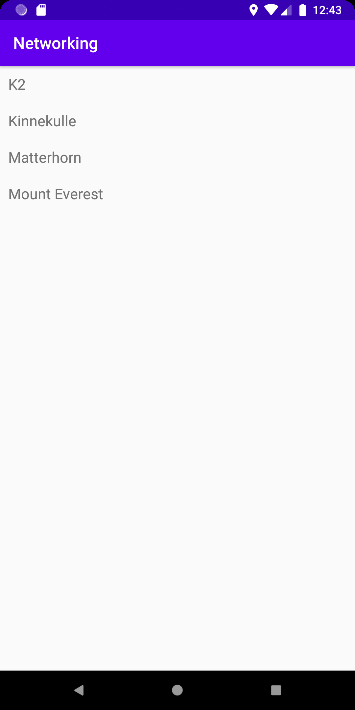

Programmering av mobila applikationer - Rapport "JSON data & HTTP networking"

För att kunna använda RecyclerView i uppgiften måste jag först importera RecyclerView i mina dependencies, App -> Gralde Scripts -> build.gradle.
Efter detta ger jag min app åtkomst till Internet för att kunna hämta data från webben.

```
    dependencies {
    
    ...
    implementation "androidx.recyclerview:recyclerview:1.1.0"
    ...
    
```
Därefter lägger jag till en ny Java klass som jag döper till "Mountain". I klassen anger jag member variables, constructors samt getters och setters.
För enkelhetens skulle i denna uppgift så väljer jag att enbart hämta namnen på bergen från den URL som vi senare ska implementera. Getters pch setters
hämtar och placerarar data för den angivna variabeln. Tillsist lägger jag till en interface, eller en metod som ska användas inom vår klass. toString()
metoden används för att kunna returnera en för oss läsbar representation av ett objekt i form av text.

```

package com.example.networking;

public class Mountain {

    //Member variables and state
    private String name;

    //Constructor
    public Mountain(String name) {
        this.name = name;
    }

    //Getter and Setter
    public String getName() {
        return name;
    }

    public void setName(String name) {
        this.name = name;
    }

    //Interface
    @Override
    public String toString(){
        return name;
    }
}

```

Nu ska vi implementera den URL som ska behövs för att hämta den data vi vill visa i vår app. URl:en för webbsidan läggs in som en
variabel i vår klass för MainActivity. I onCreate() talar vi sedan om får för appen att URL:en ska köras, d.v.s. den JSON som finns för 
URL:en ska hämtas. 

```

public class MainActivity extends AppCompatActivity implements JsonTask.JsonTaskListener {

    private final String JSON_URL = "https://mobprog.webug.se/json-api?login=brom";
    
    @Override
    protected void onCreate(Bundle savedInstanceState) {
        super.onCreate(savedInstanceState);
        setContentView(R.layout.activity_main);

        ...
        new JsonTask(this).execute(JSON_URL);
    ...

```

När JSON har hämtats och ska presenteras så översätter vi den från JSON till Java objekt genom att använda GSON. 

```

@Override
    public void onPostExecute(String json) {
        ...
        
        Gson gson = new Gson();
        Type type = new TypeToken<List<Mountain>>() {}.getType();
        List<Mountain> ListOfMountains = gson.fromJson(json, type);
        
                for (Mountain berg : ListOfMountains) {
                    Log.d("Mountain", berg.toString());
            ...

```

Nu när data kan hämtas måste den kunna visas. Därför implementerar vi en RecyclerView i vår layout fil för MainActivity (activity_main).

```

<androidx.recyclerview.widget.RecyclerView
    android:id="@+id/recycler_view"
    android:layout_width="match_parent"
    android:layout_height="match_parent"
    app:layout_constraintBottom_toBottomOf="parent"
    app:layout_constraintLeft_toLeftOf="parent"
    app:layout_constraintRight_toRightOf="parent"
    app:layout_constraintTop_toTopOf="parent" />

```

Nu behöver vi även en View som kan visa vår data, d.v.s. en View som ligger i vår RecyclerView. Därför skapar vi en ny layout med en
LinearLayout och lägger till en vanlig TextView.

```

...
<LinearLayout xmlns:android="http://schemas.android.com/apk/res/android"
...
    <TextView
        android:id="@+id/title"
        android:layout_width="wrap_content"
        android:layout_height="wrap_content"
        android:textSize="18sp"/>

</LinearLayout>

```

Hittils har vi hämtat datan vi ska avända, vi har skapat ett sätt att översätta datan samt lagt till Views att visa vår data i. 
Nu skapar vi en RecyclerViewadapter.Adaptern skapades som en egen Java klass som döptes till RecyclerViewAdapter. I klassen lades
variabler till för våra berg, layoutmanager och onClickListener. I ärlighetens snamn är jag inte helt säker på exakt hur adaptern
fungerar men jag förstår ungefärligt. Adaptern har kopierat in från Canvas och jag har bytt ut klassnamn så det ska passa min app.

```

public class RecyclerViewAdapter extends RecyclerView.Adapter<RecyclerViewAdapter.ViewHolder> {

        private List<Mountain> items;
        private LayoutInflater layoutInflater;
        private OnClickListener onClickListener;

        RecyclerViewAdapter(Context context, List<Mountain> items, OnClickListener onClickListener) {
            this.layoutInflater = LayoutInflater.from(context);
            this.items = items;
            this.onClickListener = onClickListener;
        }

        @Override
        @NonNull
        public ViewHolder onCreateViewHolder(@NonNull ViewGroup parent, int viewType) {
            return new ViewHolder(layoutInflater.inflate(R.layout.recycler_item, parent, false));
        }

        @Override
        public void onBindViewHolder(ViewHolder holder, int position) {
            holder.title.setText(items.get(position).getName());
        }

        @Override
        public int getItemCount() {
            return items.size();
        }

        public class ViewHolder extends RecyclerView.ViewHolder implements View.OnClickListener {
            TextView title;

            ViewHolder(View itemView) {
                super(itemView);
                itemView.setOnClickListener(this);
                title = itemView.findViewById(R.id.title);
            }

            @Override
            public void onClick(View view) {
                onClickListener.onClick(items.get(getAdapterPosition()));
            }
        }

        public interface OnClickListener {
            void onClick(Mountain item);
        }
    }

```

I MainActivity initierar och deklarerar vi nu vår adapter som kopplats samman med vår klass RecyclerViewAdapter under onPostExecute().
Vi kopplar även samman vår adapter med vår RecyclerView (recycler_view) för att kunna visa datan vi hämtat från webbsidan i en View.

```

RecyclerViewAdapter adapter = new RecyclerViewAdapter(this, items, new RecyclerViewAdapter.OnClickListener() {
    @Override
    public void onClick(Mountain item) {
        Toast.makeText(MainActivity.this, item.getName(), Toast.LENGTH_LONG).show();
    ...

        RecyclerView recycler_view = findViewById(R.id.recycler_view);
        recycler_view.setLayoutManager(new LinearLayoutManager(this));
        recycler_view.setAdapter(adapter);
    ...
    
```
Det sista som görs är att faktiskt visa datan. I OnPostExecute() har jag lagt till två kodsnuttar. "ArrayList<Mountain> items = new ArrayList<>()" vilket
innebär att det skapas en lista (ArrayList) av klassen/typen Mountain med värdena från variabeln items.  

Den datan som hämtats och konverterats från JSON har lagrats i "ListOfMountains". "items.add(new Mountain(berg.getName()));" innebär att
de element som finns i ListOfMountains kommer listas i vår RecyclerView, och eftersom vi angett att de ska vara av klassen Mountain så kommer klassen att 
hämta namnen på dessa berg genom getName()-metoden.

Inte den bäst förklarande rapport jag gjort men jag har gjort mitt bästa för att försöka förklara vad som gjorts!

```

@Override
public void onPostExecute(String json) {
        ...
        
        Gson gson = new Gson();
        Type type = new TypeToken<List<Mountain>>() {}.getType();
        List<Mountain> ListOfMountains = gson.fromJson(json, type);
        ArrayList<Mountain> items = new ArrayList<>();

        for (Mountain berg : ListOfMountains) {
            ...
            items.add(new Mountain(berg.getName()));
    }

```

